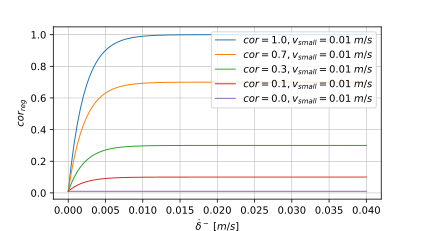
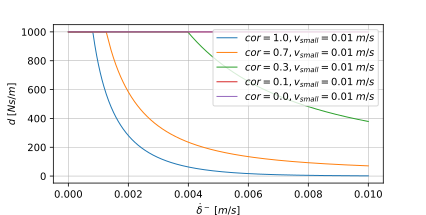


# Collision Handling

Modia3D supports collisions of objects that are defined with a contact material
and (a) have a convex geometry, or (b) can be approximated by a set of
convex geometries, or (c) have a concave geometry that is (automatically)
approximated by its convex hull. When contact occurs, the response
is computed with elastic force/torque laws based on the
penetration depth and the relative motion of the objects in contact.
It is planned to optionally also support impulsive response calculation
in the future.

The current approach has several **limitations** that a user must know,
in order that a simulation is successful:

- The current collision handling is designed for variable step-size integrators
  for systems that have realistic physical material behaviour.

- Usually, a relative tolerance of ``10^{-8}`` or smaller has to be used since
  otherwise a variable step-size integrator will typically fail. The reason is that
  the penetration depth is computed from the difference of tolerance-controlled
  variables and the precision will be not sufficient if a higher tolerance will be
  used because the penetration depth is in the order of ``10^{-5} .. 10^{-6}~ m``.

- A reasonable reliable simulation requires that objects have only
  *point contact*, since otherwise the contact point can easily ``jump`` between
  model evaluations and a variable step-size integrator will not be able to
  cope with this, so will terminate with an error.
  For this reason, all geometrical objects are slightly modified in various ways
  for the collision handling. Most important, all geometries are *smoothed* with a
  small sphere (e.g. with radius = 1mm) that is moved over all surfaces.
  Small spheres are attached at every vertex of a box so that contact most likely
  appears at these spheres or at the edges, that are smoothed with spheres.


## Material constants

The response calculation uses the following material constants from
the [`Modia3D.solidMaterialPalette3`](@ref) and the
[`Modia3D.contactMaterialPalette`](@ref) palettes given
the names of the materials, such as `"Steel"`.

- `E` in [N/m^2]: Young's modulus of contact material (``\gt 0``).
- `nu`: Poisson's ratio of contact material (``0 \lt nu \lt 1``).
- `cor`: Coefficient of restitution between *two objects* (``0 \le cor \le 1``).
- `mu_k`: Kinetic/sliding friction force coefficient between *two objects* (``\ge 0``).
- `mu_r`: Rotational rolling resistance torque coefficient between *two objects* (``\ge 0``).

Additionally, the response calculation is changed at small relative velocities
and relative angular velocities. This region is defined by the following constants:

- `vsmall` in [m/s]: Used for regularization when computing the unit vector in direction of
                     the relative tangential velocity (see below).
- `wsmall` in [rad/s]: Used for regularization when computing the unit vector in direction of
                       the relative angular velocity (see below).


## Response calculation

When two 3D objects penetrate each other with a penetration depth $\delta > 0$
then a *contact force* and a *contact torque* is computed from the elastic contact materials
of the two objects in the following way
(the contact force law in normal direction is based on [^1], [^3],
the remaining force law on [^2] with some extensions and corrections):


```math
\begin{align}
f_n        &= \max\left(0, c_{res} \cdot c_{geo} \cdot \delta^{n_{geo}} \cdot (1 + d \cdot \dot{\delta}) \right) \\
\vec{f}_n &= f_n \cdot \vec{e}_n \\
\vec{f}_t &= -\mu_{k} \cdot f_n \cdot \vec{e}_{t,reg} \\
\vec{\tau} &= -\mu_{r} \cdot \mu_{r,geo}  \cdot f_n \cdot \vec{e}_{\omega,reg}
\end{align}
```

where

- ``\vec{e}_n``: Unit vector perpendicular to the surface of object 1 at the contact point, pointing outwards.
- ``\vec{e}_{t,reg}``: Regularized unit vector in direction of the tangential relative velocity (see below).
- ``\vec{e}_{\omega,reg}``: Regularized unit vector in direction of the relative angular velocity (see below).
- ``f_n``: Value of normal contact force in direction of ``\vec{e}_n`` acting on object 2 (``f_n \ge 0``).
- ``\vec{f}_n``: Vector of normal contact force acting on object 2.
- ``\vec{f}_t``: Vector of sliding friction force acting on object 2 in opposite direction of the movement
                  in the tangential plane of the contact.
- ``\vec{\tau}``: Vector of rolling resistance torque acting on object 2, in opposite direction to the
                    relative angular velocity between the two contacting objects.
- ``\delta``: Signed distance between object 1 and 2 in normal direction ``\vec{e}_n``.
               ``\delta > 0`` if objects are penetrating each other.
- ``\dot{\delta}``: Signed relative velocity between object 1 and 2 in normal direction ``\vec{e}_n``.
- ``c_{res}``: Resultant elastic material constant in normal direction. This constant is computed
         from the constants ``c_1, c_2`` of the two contacting objects 1 and 2 as
         ``c_{res} = 1/\left( 1/c_1 + 1/c_2 \right)``. ``c_i`` is computed from the material properties as
         ``c_i = E_i/(1 - \nu_i^2)`` where ``E_i`` is Young's modules and
         ``\nu_i`` is Poisson's ratio of object i.
- ``c_{geo}``: Factor in ``f_n`` that is determined from the geometries of the
               two objects (see below).
- ``n_{geo}``: Exponent in ``f_n`` that is determined from the geometries of the
               two objects (see below).
- ``d(cor_{reg},\dot{\delta}^-)``: Damping coefficient in normal direction as a function of
         ``cor_{reg}`` and ``\dot{\delta}^-`` (see below).
- ``cor_{reg}``: Regularized coefficient of restitution between objects 1 and 2, see below.
- ``\dot{\delta}^-``: Value of ``\dot{\delta}`` when contact starts (``\dot{\delta}^- \ge 0``).
- ``\mu_k``: Kinetic/sliding friction force coefficient between objects 1 and 2.
- ``\mu_r``: Rotational rolling resistance torque coefficient between objects 1 and 2.
- ``\mu_{r,geo}``: Factor in ``\vec{\tau}`` that is determined from the geometries of the
                    two objects (see below).

The ``\max(..)`` operator in equation (1) is provided, in order
to guarantee that ``f_n`` is always a compressive and never a pulling force because
this would be unphysical.

In special cases (for example sphere rolling on a plane), the rotational coefficient of friction ``\mu_{r,res}``
can be interpreted as *rolling resistance coefficient*.

Coefficients ``c_{geo}, n_{geo}, \mu_{r,geo}`` depend on the geometries of the objects
that are in contact. Only for spheres meaning values are provided based on Hertz' pressure,
because currently the collision handling in Modia3D does no provide enough information for other
geometries (``r_i`` is the radius of sphere ``i``):

| Object 1    | Object 2  | ``c_{geo}``                              | ``n_{geo}`` | ``\mu_{r,geo}``    |
|:----------- |:--------- |:---------------------------------------- |:------------|:------------------- |
| Sphere      | Sphere    | ``\frac{4}{3} \sqrt{1/(1/r_1+1/r_2)}`` | ``1.5``     | ``1/(1/r_1+1/r_2)`` |
| Sphere      | no Sphere | ``\frac{4}{3} \sqrt{r_1}``             | ``1.5``     | ``r_1``             |
| no Sphere   | no Sphere | ``1``                                    | ``1.0``     | ``1.0``             |


## Regularized unit vectors

The unit vectors ``\vec{e}_t, \vec{e}_{\omega}`` are undefined if the relative velocity and/or
the relative angular velocity vanish. They are therefore approximately calculated using utility
function ``reg(v_{abs}, v_{small})``. This function returns ``v_{abs}`` if ``v_{abs} \ge v_{small}``
and otherwise returns a third order polynomial with a minimum of ``v_{small}/3`` at ``v_{abs}=0`` and
smooth first and second derivatives at ``v_{abs} = v_{small}``):

```math
reg(v_{abs}, v_{small}) = \text{if}~ v_{abs} \ge v_{small} ~\text{then}~ v_{abs} ~\text{else}~
                          \frac{v_{abs}^2}{v_{small}}
                          \left( 1 - \frac{v_{abs}}{3v_{small}} \right) + \frac{v_{small}}{3}
```

Example for ``v_{small} = 0.1``:


With ``\vec{v}_i`` the absolute velocity of the contact point of object ``i``,
and ``\vec{\omega}_i`` the absolute angular velocity of object ``i``,
the regularized unit vectors are calculated with function ``reg(...)``
in the following way:

```math
\begin{align}
\vec{e}_{t,reg}       =& \frac{\vec{v}_{rel,t}}{reg(|\vec{v}_{rel,t}|, v_{small})}; \quad
                          \vec{v}_{rel} = \vec{v}_2 - \vec{v}_1; \;
                          \vec{v}_{rel,t} = \vec{v}_{rel}  - (\vec{v}_{rel} \cdot \vec{e}_n) \vec{e}_n \\
\vec{e}_{\omega,reg} =& \frac{\vec{\omega}_{rel}}{reg(|\vec{\omega}_{rel}|,\omega_{small})}; \quad
                          \vec{\omega}_{rel} = \vec{\omega}_2 - \vec{\omega}_1
\end{align}
```

The effect is that the absolute value of a regularized unit vector
is approximated by the following smooth characteristics (and therefore the corresponding
friction force and contact torque have a similar characteristic)


## Damping coefficient

There are several proposal to compute the damping coefficient as a function
of the coefficient of restitution ``cor`` and the
velocity when contact starts ``\dot{\delta}^-``.
For a comparision of the different formulations see [^1].

Whenever the coefficient of restitution ``cor > 0``, then an object 2 jumping on an object 1 will
mathematically never come to rest, although this is unphysical. To fix this, the value of a
coefficient of restitution is reduced when the velocity at contact start becomes small.
Furthermore, the coefficient of restitution is restricted to not become smaller as a minimum value
``cor_{min} = 0.001`` in order to avoid a division by zero when computing the damping coefficient.
The following regularization function is used:

```math
cor_{reg} = cor_{lim} + (cor_{min} - cor_{lim}) \cdot e^{log(0.01) |\dot{\delta}^-|/v_{small}}; \;\;
            cor_{lim} = \max(cor_{min}, cor)
```

Examples of this characteristics are shown in the next figure:




The damping coefficient ``d`` is basically computed with the formulation from [^1]
because a response calculation with impulses gives similar results for some experiments
as shown in [^3]. However, (a) instead of the coefficient of restitution, the regularized form
from above is used, (b) ``|\dot{\delta}^-|`` is regularized to avoid a division by zero,
and (c) the damping coefficient is limited to ``d_{max} = 1000`` to avoid an unphysical
strong creeping effect for collisions with small ``cor_{reg}`` values:

```math
d(cor_{reg},\dot{\delta}^-) = \min(1000, \frac{8(1-cor_{reg})}{\left(5 \cdot cor_{reg} \cdot reg(|\dot{\delta}^-|, v_{small}) \right)})
```

Examples of this characteristics are shown in the next two figures:





In the next figure the simulation of a bouncing ball is shown where the response
calculation is performed (a) with an impulse and (b) with the compliant force law above.
In both cases the regularized coefficient of restitution ``cor_{reg}`` is going to zero
when ``|\dot{\delta}^-|`` becomes small. As can be seen, both formulations lead to
similar responses:


## Literature
[^1]: Paulo Flores, Margarida Machado, Miguel Silva, Jorge Martins (2011):
      [On the continuous contact force models for soft materials in
      multibody dynamics](https://hal.archives-ouvertes.fr/hal-01333699).
      Multibody System Dynamics, Springer Verlag,
      Vol. 25, pp. 357-375. 10.1007/s11044-010-9237-4.

[^2]: Martin Otter, Hilding Elmqvist, José Díaz López (2005):
      [Collision Handling for the Modelica MultiBody Library](https://modelica.org/events/Conference2005/online_proceedings/Session1/Session1a4.pdf).
      Proceedings of the 4th International Modelica Conference 2005,
      Gerhard Schmitz (Ed.), pages 45-53.

[^3]: Luka Skrinjar, Janko Slavic, Miha Boltezar (2018):
      [A review of continuous contact-force models in multibody dynamics](https://doi.org/10.1016/j.ijmecsci.2018.07.010).
      International Journal of Mechanical Sciences, Volume 145,
      Sept., pages 171-187.

